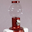

# Thomas  Servo  Eskwire

### Sophisticated Servo Management for the Discriminating User.

The TomServo library lets you power multiple servos
from a single rechargeable battery.  By putting the
servo control pin into a high-z state when it is not 
being used we can disable the driving of the servo
and greatly reduce the current demands.

By multiplexing the movements of several servos
so that only one is on at a time you can run up
to 8 servos from a single battery. Or many more
using only a few batteries!
